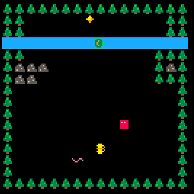

# mimic

## Game world constraints

- Shouldn't be able to move over an actor
- Shouldn't move over flagged tile that you don't have the ability for

## TODO

- [x] Player Movement - Unnati
- [x] Handle actor collision - Nana/Souren
- [x] Handle map collision - Nana/Souren
- [ ] Flip sprite up or down (vertical) - Unnati
- [X] Non-player actor movement (preconfigured movements) - Souren
- [ ] Taking over other actor's ability to move over tiles (https://github.com/SourenP/mimic/pull/2) - Souren
- [ ] Winning mechanic(retrieving diamond should cause you to win)
- [ ] Level design - Souren/Nan/Unnati
- [ ] Level navigation/loading - Souren/Nana/Unnati
- [ ] Game music - Nana
