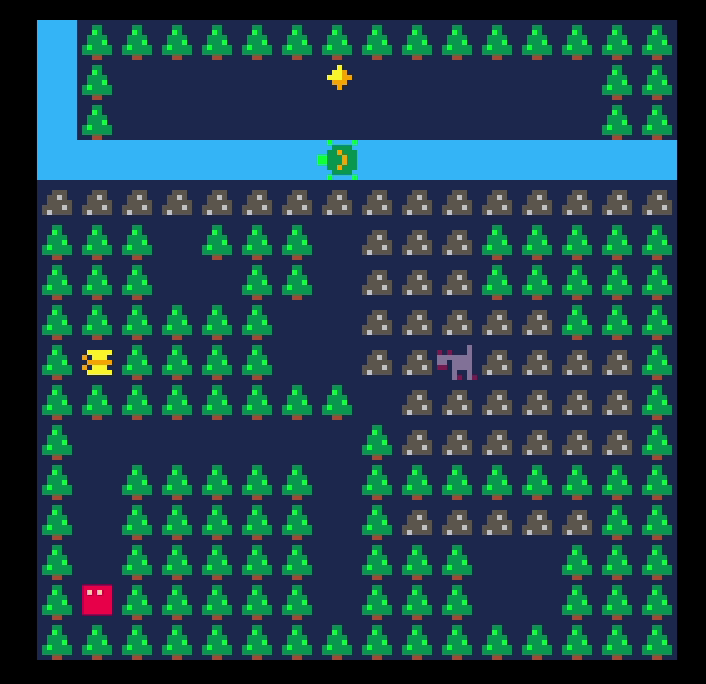

# mimic
Tile based puzzle game made on PICO-8 during a Recurse Center game jam.

[Play here!](https://www.lexaloffle.com/bbs/?tid=37345)

Made by [sourenp](https://github.com/sourenp), [v3rse](https://github.com/v3rse) and [unna97](https://github.com/unna97)

### Ideas for more mechanics
- [ ] Aquire disadvantage of animal you mimicked in addition to advantage
  - Create predator animals that will hunt you if they are your pray
- [ ] Give certain animals the ability to modify tiles
  - e.g. bug can eat (clear) grass tiles
- [ ] Give certain animals special movement patterns
  - e.g. Frog that can jump over tiles that it's not able to normally walk on
- [ ] Use the environment to be able to mimic an animals movement
  - e.g. push a rock in front of an animal to change their movement into a pattern you're able to mimic

### Todo

- [ ] Add instruction that you win by getting to the golden diamond
- [ ] Remind of restart button when player stuck
- [ ] Add level system and more levels
- [ ] Add music
- [ ] Redesign mimic pattern requirements
  - I think the loop only registers at one start/end position in the pattern. This forces you to do the loop more than once to transform and throws players off.
