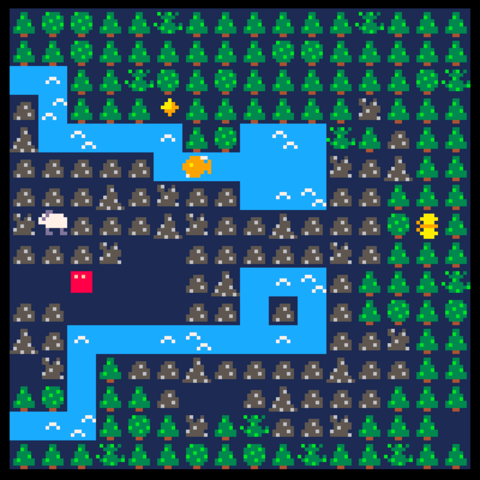

# mimic
A tile based puzzle game where you can transform into animals by mimicking their movement.

[Play here!](https://www.lexaloffle.com/bbs/?tid=37345)

Made by [sourenp](https://github.com/sourenp), [v3rse](https://github.com/v3rse) and [unna97](https://github.com/unna97)

### Ideas for more mechanics
- [ ] Aquire disadvantage of animal you mimicked in addition to advantage
  - Create predator animals that will hunt you if they are your pray
- [ ] Give certain animals the ability to modify tiles
  - e.g. bug can eat (clear) grass tiles
- [ ] Give certain animals special movement patterns
  - e.g. Frog that can jump over tiles that it's not able to normally walk on
  - e.g. Bird that can fly over river (can move tree->river and river->tree but not river->river)
- [ ] Use the environment to be able to mimic an animals movement
  - e.g. push a rock in front of an animal to change their movement into a pattern you're able to mimic

### Resources

- [First Steps in PICO-8: Easy Collisions with Map Tiles](http://gamedev.docrobs.co.uk/first-steps-in-pico-8-easy-collisions-with-map-tiles)
- [How I make a dependency graph](https://www.patreon.com/posts/how-i-make-graph-20631617)
